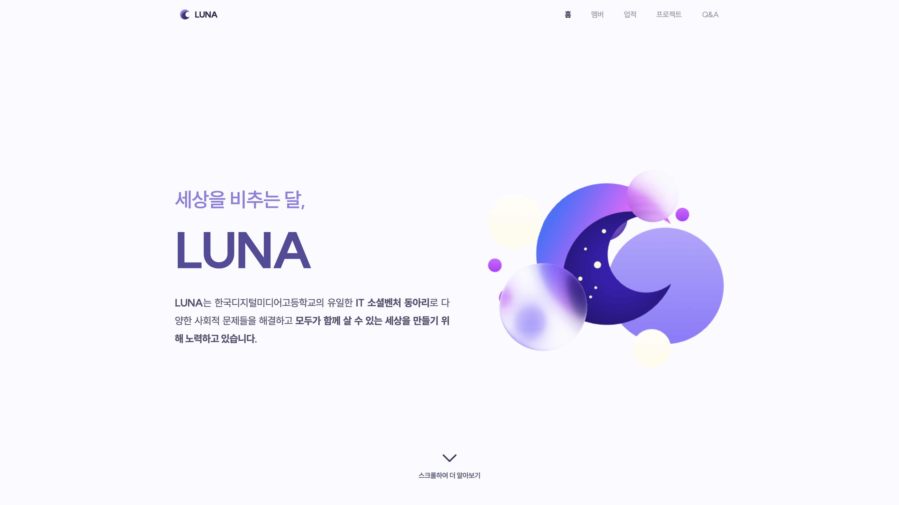
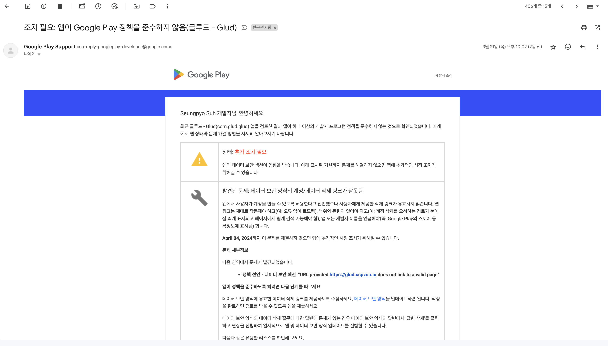

---

# **OT Contents**

### 1. 개발팀 소개

### 2. 무엇을 공부해야 하는가?

### 3. 로드맵

### 4. 간단한 개발 프로세스

### 5. 환경설정

---

# 1. 개발팀 소개

---

# 서승표

## **22HD | Mobile & Frontend**

**디미고 인트라넷 개발팀, 딘 PM**

**교내 무인매점 결제 솔루션, 디미페이 개발팀**

**제5회 한국코드페어 해커톤 금상**

**前 정보보안 동아리, Stealth & STARE**


---

# 김형석

## **22HD | AI & Robotics**

**GENIUS Olympiad 한국대표단**

**2024 KSEF 은상**

**학생회 IT부, 디미페이 개발팀**

**제4회 한국코드페어 SW공모전 은상**


---

# 박시혁

## **22HD | Web Full Stack**

**2024 DIMI CTF 개발 및 운영**

**WACON 2023 본선 진출**

**구름 알고리즘 하이스쿨 경기도 대상**

**제4회 한국코드페어 해커톤 대상**


---

# 2. 무엇을 공부해야 하는가?

---

# 우리는 **정올**을 나갈 게 아니다!

```kotlin
when (x) {
    0, 1 -> print("boolean")
    2 -> print("콩\n콩")
    !in 1..9 step 2 -> print("홀수 아님")
    in 0..9 -> print("한자릿수")
    else -> print("otherwise")
}
```

### 이런 거 공부할 필요가 없다

(특히 요즘은 gpt가 다 해줌)

---

알고리즘과 문법 공부 대신

# **개발**을 공부해야 한다

```zsh
$ git push origin master

To https://github.com/dimipay/dimipay_app_v2

! [rejected]    master -> master (fetch first)

error: failed to push some refs to 'https://github.com/dimipay/dimipay_app_v2'
hint: Updates were rejected because the remote contains work that you do
hint: not have locally. This is usually caused by another repository pushing
hint: to the same ref. You may want to first integrate the remote changes
hint: (e.g., 'git pull ...') before pushing again.
hint: See the 'Note about fast-forwards' in 'git push --help' for details.
```

---

## Googling (Google, StackOverFlow)

## Notion, Figma, PPT

## Shell (Bash, Zsh, PowerShell)

## Git (GitHub)

## **ChatGPT 활용**

---

# 문법은

```
어떤 함수들이 있는가?
```

```
이런 거 써서 구현할 수 있겠다
```

# 이 정도만

---

# 3. 로드맵

---

# 4월 ~ 5월

## 웹 개발 중심으로 '개발' 배우기

## 필요한 경우 백엔드는 간단하게만

## **루나 웹사이트 만들기 (부서 공통)**

---



---

# 배우는 것

### HTMl, CSS, Javascript

### NodeJS (express)

### Git, Github

### Docker, AWS

---

# 6월 ~ 7월

## 포지션 선택 후 심화 공부 (App, Web, Backend)

## 창업동아리 프로젝트 시작

## 시간 오래 주는 대회 프로젝트 시작

---

# 배우는 것

### **React**, **NextJS**

### **Flutter** OR **RN**

### **Express** OR **NestJS**

### Etc.

---

# 4. 간단한 개발 프로세스

---

## **1. 요구사항 분석**

기획에서 요구하는 기능들을 파악하고

구현하고자 하는 기능을 개발하기 편한 기술 찾기

---

## **2. 설계 (디자인)**

기획된 서비스를 디자인하는 과정에서

**하나도 빠뜨리지 않겠다는 생각으로** 디자인에 피드백 하기

나중에 추가해달라고 하면 곤란함

---

## **3. 구현**

우리는 기밀 유출 걱정이 없기 때문에, AI 사용 적극 권장

오류 고치는 데 굉장한 시간을 소모할 것

물음표 살인마 괜찮습니다

---

## **4. 테스트**

로컬에선 괜찮은데 서버 올라가면 오류가 생길 수 있음

디미고엔 해커들이 존재

---

## **5. 배포**

Vercel, AWS를 이용해 배포

Docker, CD/CI 활용

---

## **6. 유지보수**

이메일 열심히 확인하기

---



---

# 5. 환경설정

---

# 회원가입

### 1. GitHub

### 2. Notion

### 3. Figma

### 4. **ChatGPT** OR **Claude**

---

# 개발 환경 준비

### 1. Git 사용 환경 설정하기

### 2. Code Editer 아무거나 설치하기 ex) vscode, WebStorm

### 3. NodeJS 설치하기

---

# 하는 방법은 **htd.sspzoa.io**

### **궁금한 거 있으면**

**Insta: `@_s._.pyo`**

**Discord: `sspzoa`**

**아니면 카톡**

---

# 다음 시간에 계속...
